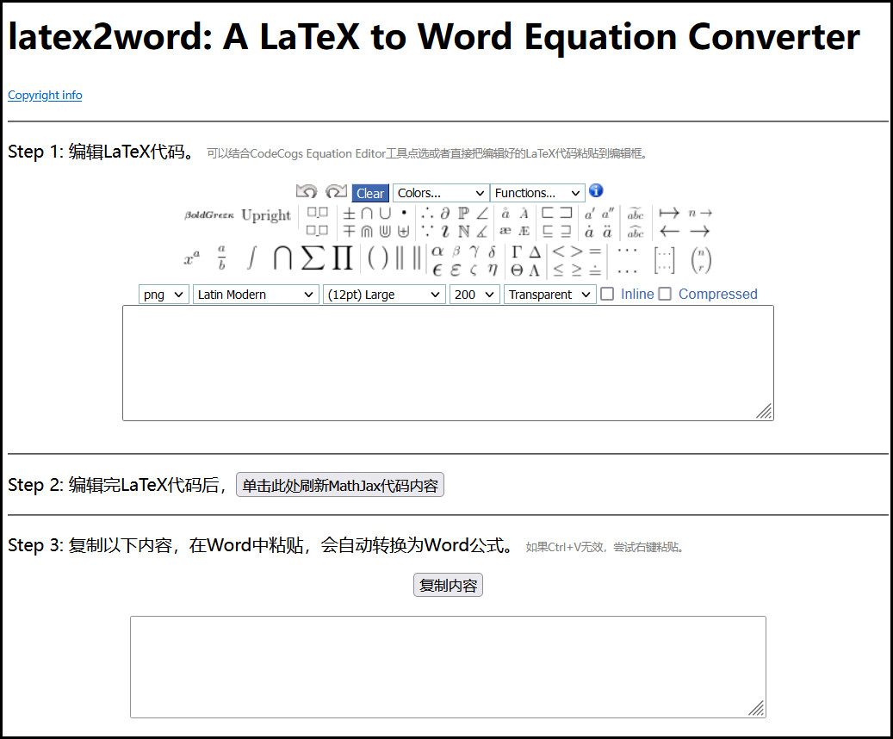

# A LaTeX to Word Equation Converter
用来替代MicroSoft Word自带的公式编辑器，直接编辑LaTeX代码然后粘贴到Word中即可。

[点此打开链接使用](latex2word.html)

需要联网加载CodeCogs Equation Editor，加载完全的页面如下图所示，如果加载不完全，请使用代理上网。

 

[原仓库地址](https://github.com/cyrildtm/latex2word)